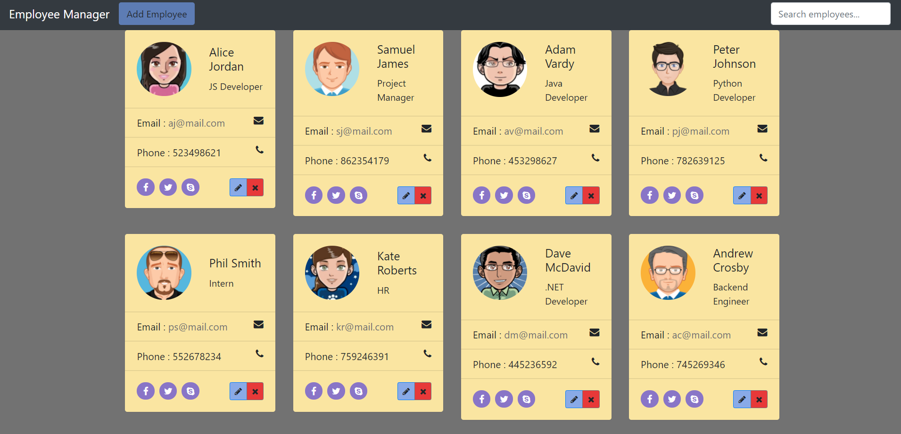

# Employee Manager App

## A simulation one-page application for managers to control and manage personnel

## Technologies used:
### &emsp; Backend: SpringBoot, MySQL
### &emsp; Frontend: Angular, TypeScript, HTML, CSS

### [This snippet](https://www.bootdey.com/snippets/view/bs4-contact-cards) has been used as a base.

